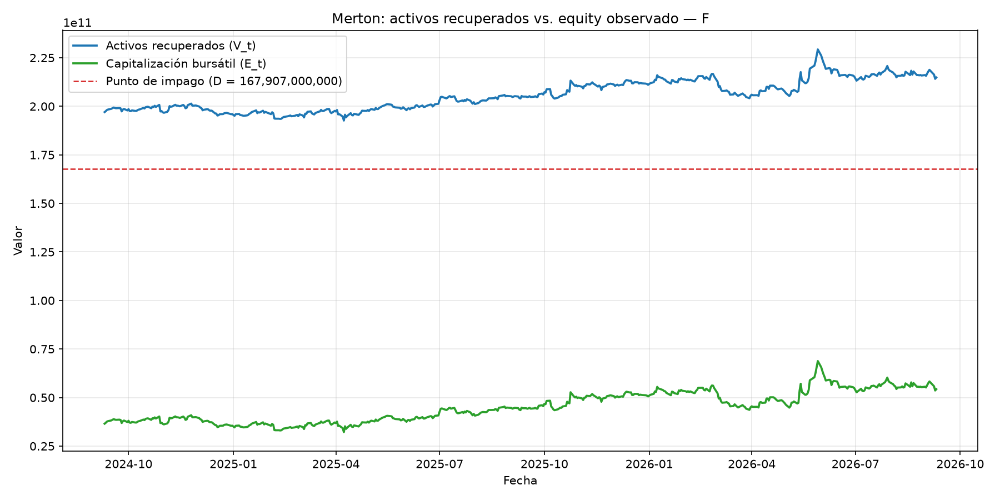
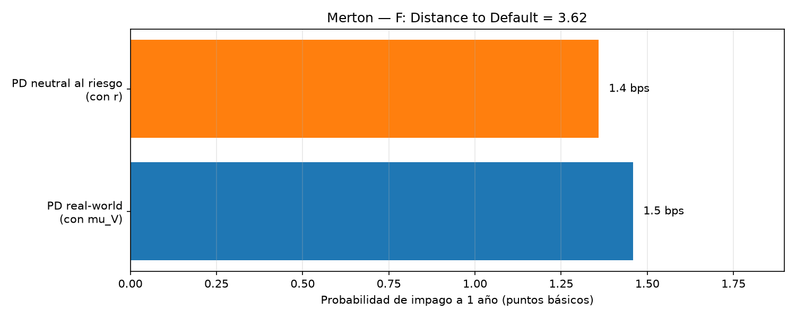

# 🏦 Credit Risk: Merton Structural Model

> Treating a company's equity as a call option on its assets — reusing the Black-Scholes engine from Project 6 to estimate a real company's probability of default, entirely from public equity and balance-sheet data.


---

## What it does

Implements the **Merton (1974) structural credit risk model**: a company's equity is modeled as a European call option on the value of its assets, with strike equal to its debt. This single insight — "equity is a call option" — lets Black-Scholes, a *derivatives pricing* formula, answer a completely different question: **what is the probability that a real company defaults on its debt within a year?**

The catch is that the two inputs Black-Scholes needs — the value of the firm's assets `V` and their volatility `sigma_V` — are never directly observable. Only the market value of equity `E` (market cap, observable daily) and the volatility of equity `sigma_E` (estimable from historical returns) are. This project implements the standard industry procedure (the methodology behind Moody's KMV) to invert the relationship and recover `V` and `sigma_V`, then computes the company's **Distance to Default** and **probability of default**, for a real, live ticker.

## Why this project is different from the rest of the portfolio

This is the strongest link between any two projects in the portfolio: it reuses `black_scholes.py` from Project 6 **completely unmodified**, for a domain that has nothing to do with options trading. It's also the first credit risk project — every prior project has been about equities and derivatives markets, not the balance sheet or default risk.

## Dashboard preview

| Assets recovered vs. equity observed | Default probability |
|---|---|
|  |  |

The full interactive version is in [`outputs/dashboard.html`](outputs/dashboard.html): just double-click to open it, no server required.

## Project structure

```
credit-risk-merton-model/
├── README.md
├── requirements.txt
├── config/
│   └── credit.py            <- ticker, risk-free rate, horizon, solver tolerances
├── data/                    <- cached market-cap snapshot (record, not a read cache)
├── notebooks/               <- Jupyter exploration
├── src/
│   ├── data.py                 <- equity market cap + balance-sheet default point (yfinance)
│   ├── merton.py                <- the KMV iterative procedure; reuses Project 6's black_scholes.py
│   ├── visualize.py               <- static charts (matplotlib): assets vs. equity + PD bars
│   ├── dashboard.py                 <- interactive dashboard (Plotly) -> outputs/dashboard.html
│   └── main.py                       <- orchestrates the pipeline
└── outputs/                 <- generated charts and dashboard
```

## How to run it

```bash
python -m venv venv
source venv/bin/activate  # on Windows: venv\Scripts\activate
pip install -r requirements.txt
python src/main.py
```

On completion, the console prints the recovered asset value/volatility and the default probabilities, and the following are generated in `outputs/`: `assets_vs_equity.png`, `default_probability.png` and `dashboard.html`.

### A note on SSL certificates
Same mechanism as in the earlier projects: if `yfinance` fails with `CERTIFICATE_VERIFY_FAILED` (typical with antivirus software that inspects HTTPS traffic, e.g. Norton), `src/data.py` automatically uses a local certificate bundle at `.certs/cacert.pem` if present.

## The model: equity as a call option on the firm's assets

```
E = V · N(d1) − D · e^(−rT) · N(d2)          (= Black-Scholes call price, S=V, K=D)
σ_E · E = N(d1) · σ_V · V                     (Itô's lemma relates equity vol. to asset vol.)
```

`V` and `σ_V` are unknowns, solved with the standard **KMV iterative procedure**:

1. Start with `σ_V ≈ σ_E · E / (E + D)` — the deleveraged equity volatility, a first approximation.
2. With `σ_V` fixed, invert `E_t = BlackScholes(V_t, D, T, r, σ_V)` **day by day** to recover the asset-value series `V_t` — Newton-Raphson on the *underlying* `V` this time (not on `σ`, unlike Project 6's `implied_vol.py`), using `delta()` from `black_scholes.py` as the derivative, unmodified.
3. Re-estimate `σ_V` as the annualized volatility of `V_t`'s log returns.
4. Repeat 2–3 until `σ_V` converges.

With the converged `V` and `σ_V`:

```
Distance to Default = [ln(V/D) + (μ_V − 0.5·σ_V²)·T] / (σ_V·√T)
PD (real-world)       = N(−DD)              using μ_V, the estimated real drift of the assets
PD (risk-neutral)      = N(−d2)             using r — the same d2 as the Black-Scholes price
```

`D`, the default point, follows the standard KMV convention: **current liabilities + 0.5 × long-term debt** (not total debt) — long-term debt doesn't come due within the model's 1-year horizon, so it only counts at half weight as near-term default pressure.

## Results

_(live data — ticker **F** (Ford), chosen deliberately over a low-debt ticker like the AAPL used in Project 6, so leverage — and default risk — are actually meaningful)_

| | Value |
|---|---|
| Company | Ford Motor Co. (F) |
| Market cap (E) | 54,330,990,963 |
| Default point (D) | 167,907,000,000 (current liabilities + 0.5 × long-term debt) |
| Historical equity volatility (σ_E) | 35.1% |
| Recovered asset value (V) | 214,849,246,742 (V/D = 1.28x) |
| Recovered asset volatility (σ_V) | 7.9% |
| Estimated asset drift (μ_V) | +4.35% |
| Distance to Default | 3.62 |
| Probability of default (real-world) | 1.5 bps (0.015%) |
| Probability of default (risk-neutral) | 1.4 bps (0.014%) |

## Key findings

- **Ford's 35% equity volatility comes almost entirely from financial leverage, not business risk**: the recovered *asset* volatility is only 7.9% — a >4x gap. This is the textbook Modigliani-Miller leverage effect made concrete: with debt ~3x equity, a modest swing in the value of the underlying business gets amplified into a much larger swing in the residual equity value. It's a clean, numeric answer to "why is this stock so volatile relative to how stable the actual business is."
- **A >4x leverage ratio still produces a very low 1-year default probability (~1.5 bps)** because what matters for Distance to Default isn't the leverage ratio alone, but leverage *relative to asset volatility*: `V` sits 28% above `D`, and with asset volatility as low as 7.9%, the assets would need an unusually large, fast move to cross the default point within a year. This is a useful corrective to a common intuition — "high leverage ⇒ high default risk" is incomplete without also asking how volatile the underlying business actually is.
- **This default point conflates two very different kinds of debt**: Ford's balance sheet includes Ford Credit, its captive auto-financing arm, whose debt (mostly securitized loans backed by matching receivables) behaves very differently from operating-company debt. Applying Merton to the whole consolidated balance sheet — as this project does, for simplicity — is a known real limitation of the structural approach for financial/captive-finance-heavy firms, and worth flagging explicitly rather than treating the PD as literally precise.

## Concepts to be able to explain in an interview

- **Equity as a call option**: why limited liability makes this analogy exact — equity holders get max(assets − debt, 0) at maturity, precisely a call payoff — and what that implies about the incentives of equity holders vs. bondholders (risk-shifting).
- **Why V and σ_V must be solved jointly, not directly**: two unknowns, two equations (the price relationship and the Itô volatility relationship), solved by iterating to a fixed point rather than a single inversion.
- **Real-world vs. risk-neutral probability of default**: why they differ (a risk premium embedded in `r` vs. the real growth rate `μ_V` of the assets), and why credit risk management cares about the real-world number while derivatives pricing cares about the risk-neutral one.
- **Known limitations of the structural approach**: constant asset volatility (same critique as Black-Scholes itself), a static single-maturity debt structure (real firms have layered, rolling debt), and — as found in this project — the difficulty of defining a clean default point for firms with large financial subsidiaries.
